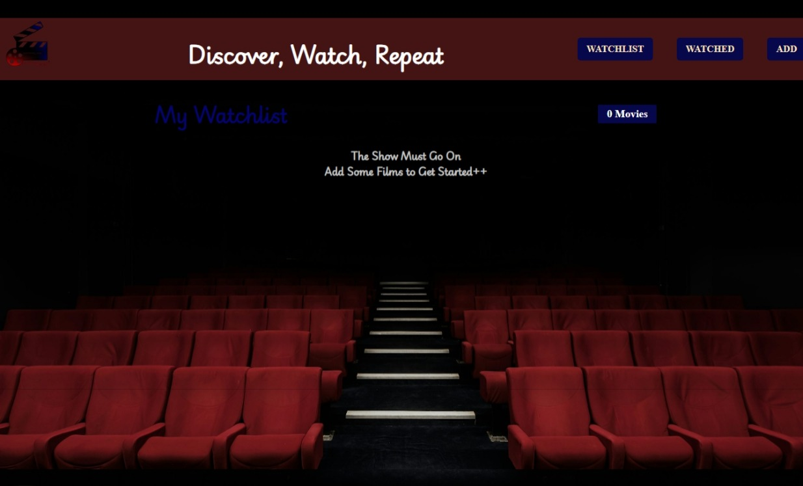

## Movie Watchlist App

A Movie Watchlist app built with React that allows users to search for movies using the OMDb API, add them to a personal watchlist, and mark movies as watched. This project demonstrates API integration and basic state management in React.

## Tech Stack: React, API

## Features:
- Search for movies via the OMDb API
- Add and remove movies from the watchlist
- Mark movies as watched
- Simple and intuitive UI
- Responsive design for an optimal experience on different devices

